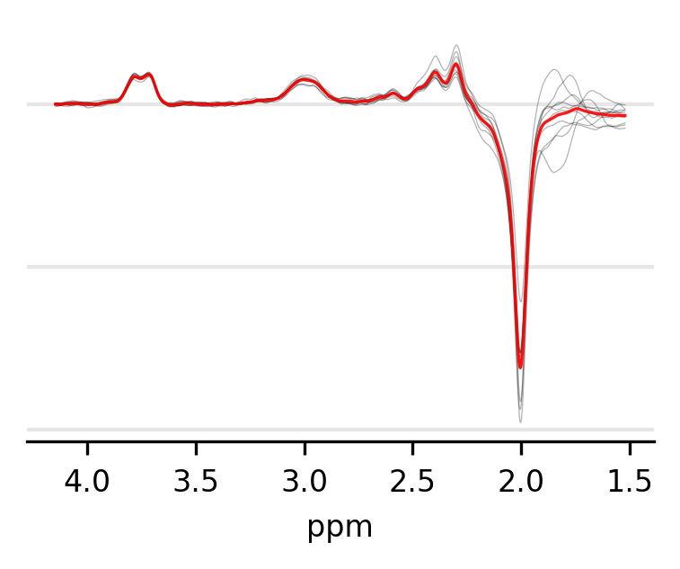

# MRS-voxel-plot
Example code to create informative MRS voxel and spectra figures for publication.  
#### Figure type 1 - MRS voxel overlaps

Present the overlap in MRS voxels for all participants in a single or multiple groups.  
#### Figure type 2 - MRS voxel centroids

Calculate and show MRS voxel centroids for all participants in single or multiple groups.  

#### Figure type 3 - MRS spectra  

Present individual and group average MRS spectra.

# Dependencies
- Numpy (https://numpy.org)
- Matplotlib (https://matplotlib.org)
- Nilearn (https://nilearn.github.io)
- Pandas (https://pandas.pydata.org)

# Data organisation
The scripts assume that your data are in folders organised in a manner similar to the BIDS standard (https://bids.neuroimaging.io/).  

Participant IDs and group labels (where relevant) should be in a TSV file that conforms to this standard.  

Voxel mask files should be in NIFTI format and already aligned to MNI152 standard space.  

Separate MRS spectra text files for each participant are required, along with a text file containing the corresponding spectral frequency at each point.

# Acknowledgement
When using this code please cite:  
Truong, V., Duncan, N.W., 2020. Suggestions for improving the reporting of magnetic resonance spectroscopy voxels and spectra (preprint). Open Science Framework. https://doi.org/10.31219/osf.io/rua9f

Please also cite https://www.frontiersin.org/articles/10.3389/fninf.2014.00014/full when using nilearn.
